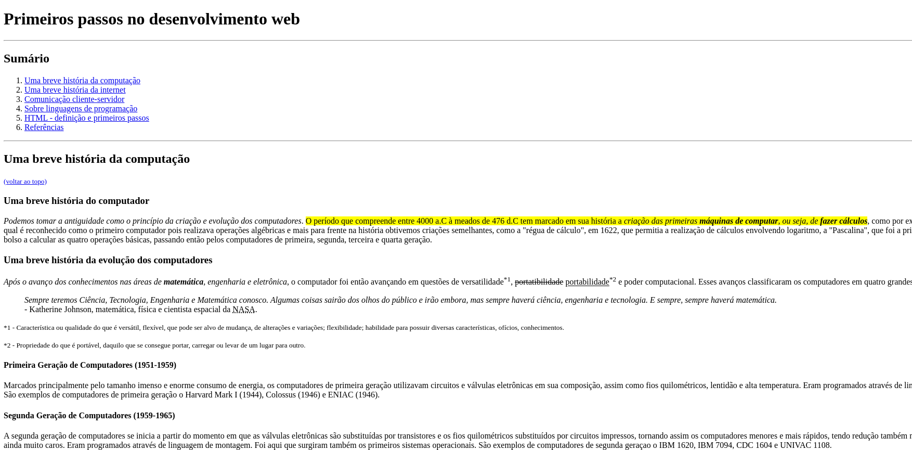

# HTML-web-developer-dio

Desafios de projeto desenvolvidos por mim através do curso "Formação HTML Web Developer", lecionado pela plataforma de educação DIO.

## Desafio de projeto 1

No primeiro desafio de projeto desenvolvi um artigo de blog utilizando apenas a Linguagem de Marcação de Hipertexto (HTML).

