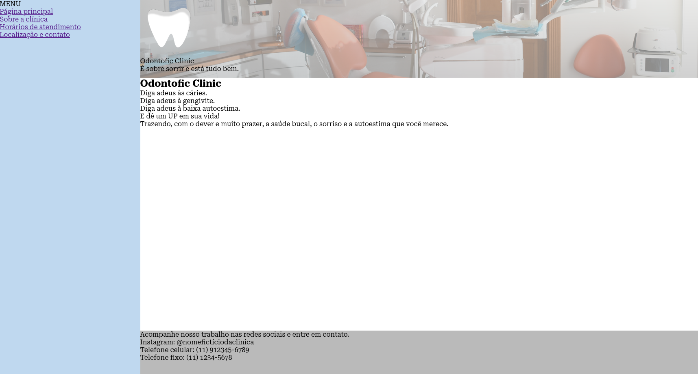

# HTML-web-developer-dio

Aqui contém todo o conteúdo do curso "Formação HTML Web Developer" lecionado pela plataforma de educação DIO, assim como os códigos-fonte de exemplo realizados nas aulas e desafios de projeto propostos. Seja bem-vindo!

## Desafio de projeto 1

No primeiro desafio de projeto desenvolvi um artigo de blog utilizando apenas a Linguagem de Marcação de Hipertexto (HTML).

## Desafio de projeto 2

No segundo desafio de projeto desenvolvi um site completo em relação aos recursos que o HTML disponibiliza, com navegação em múltiplas páginas, utilização de tabelas, formulário e iframe. Utilizei recursos do CSS apenas para estilização básica da página, mas o intuito não era organizar e estilizar os elementos HTML porém apenas utilizá-los.

